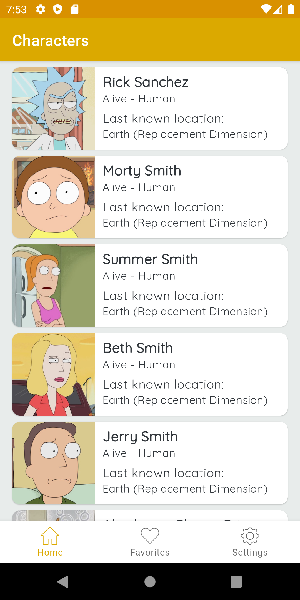
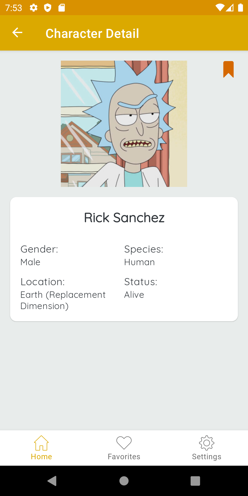
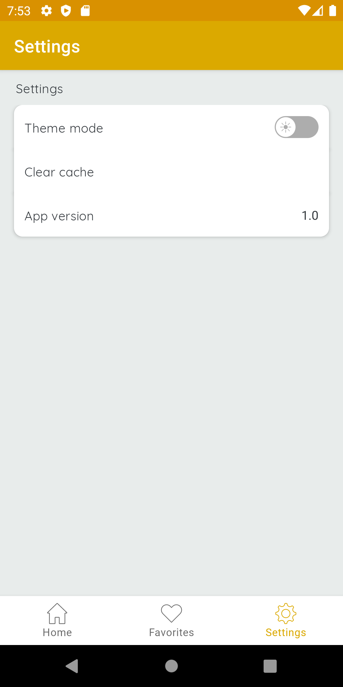
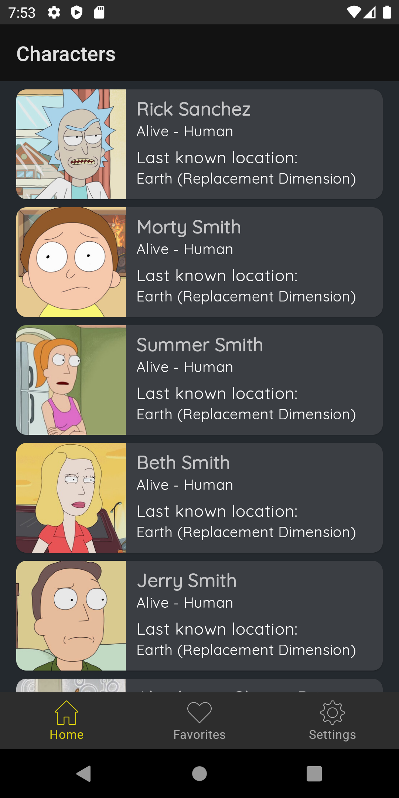
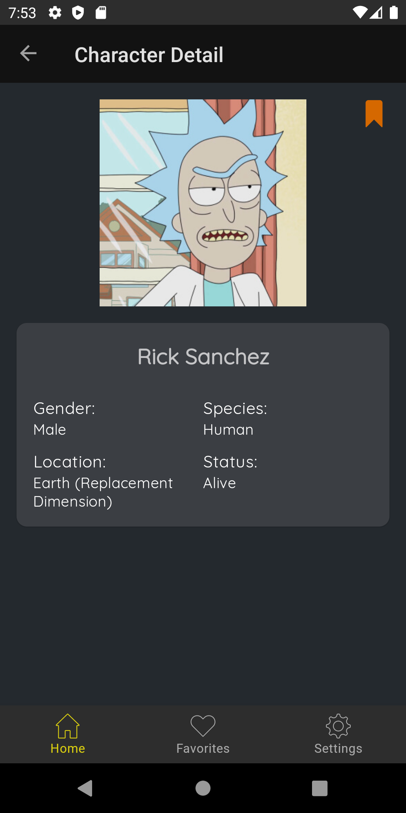
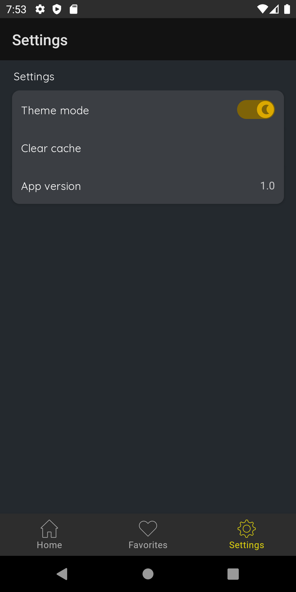
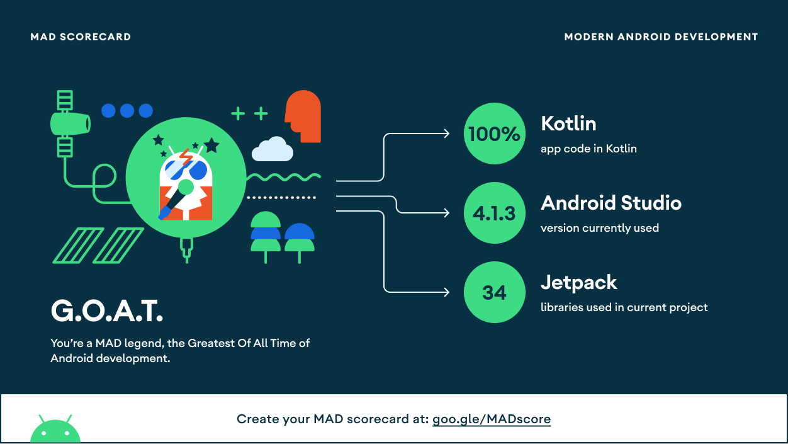

# Rick-and-Morty
The Rick And Morty - MVVM with a clean architecture approach using some of the best practices in Android Development.

## Architecture
Uses concepts of the notorious Uncle Bob's architecture called [Clean Architecture](https://blog.cleancoder.com/uncle-bob/2012/08/13/the-clean-architecture.html). 

* Better separation of concerns. Each module has a clear API., Feature related classes life in different modules and can't be referenced without explicit module dependency.
* Features can be developed in parallel eg. by different teams
* Each feature can be developed in isolation, independently from other features
* faster compile time

## Modules:
* **rick-and-morty-ui** - It uses all the components and classes releated to Android Framework. It gets the data from presentation layer and shows on UI. (**access all the modules**)
* **data** - The data layer implements the repository interface that the domain layer defines. This layer provide a single source of truth for data. (Kotlin module that **can only access domain module**)
* **remote** - Handles data interacting with the network. (**can only access data module**)
* **cache** - Handles data interacting with the local storing (Room DB). (**can only access data module**)
* **domain** - The domain layer contains the UseCases that encapsulate a single and very specific task that can be performed. This task is part of the business logic of the application. (Kotlin module that **cannot access any other module**)
* **presentation** - MVVM with ViewModels exposing LiveData that the UI consume. The ViewModel does not know anything about it's consumers. (Android module that **can only access domain module**)

## Screenshots
| | | |
|--|--|--|
| | | | 
|Dark mode| | |
| | | | 

## MAD Scorecard

## Tech Stack:
